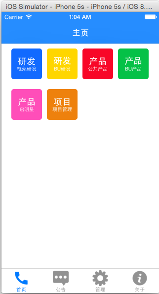
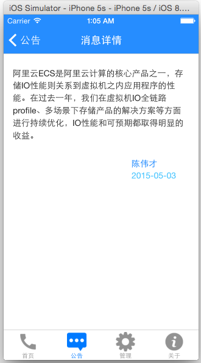
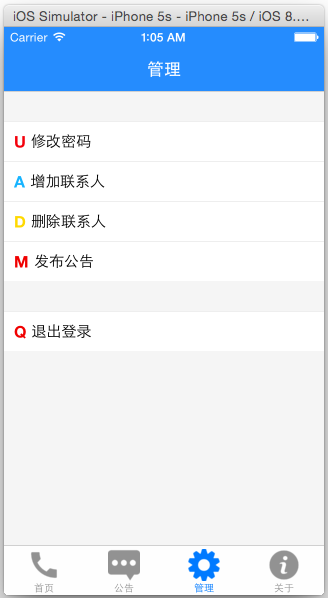
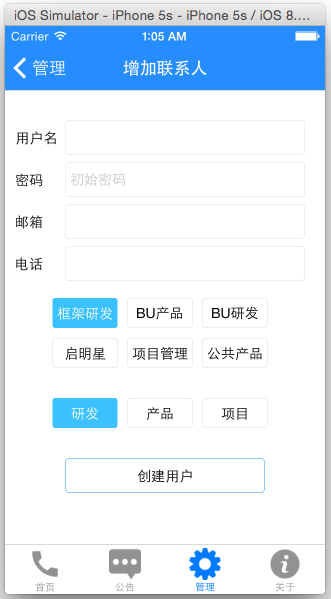
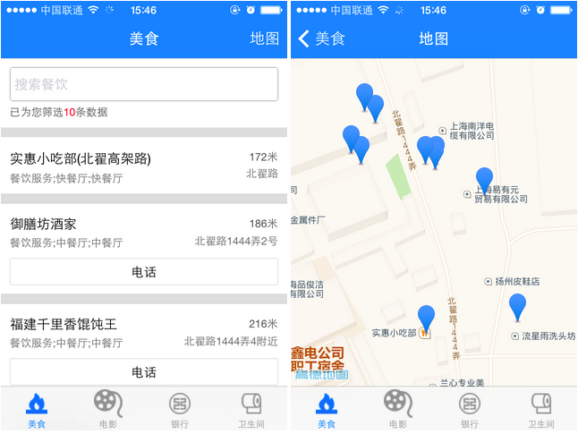

**个人博客**：http://t.aissues.com/   

# React-Native-App

React-Native实战Simple App           

### 0. 已上线iOS App       
仓库地址： https://github.com/vczero/toilet          
**苹果App Store搜索 厕所在哪, 即可下载**          

### 一、基于React-Native & Node通讯录App
1.主要完成的功能有：             

+ 基于文件系统的Node.js服务端;
+ 通讯录功能（分类页 ＋ 列表页 ＋ 拨号邮箱邮件）
+ 公告功能（列表页 ＋ 详情页）
+ 通讯录和内容管理功能
+ webview内嵌实例
效果如下图所示：

<div style="text-align:center; min-height:100px;width:100%;">
    
    
</div>

<div style="text-align:center; min-height:100px;width:100%;">
    
    
</div>

<div style="text-align:center; min-height:100px;width:100%;">
    
    
</div>

<div style="text-align:center; min-height:100px;width:100%;">
    
</div>

2.安装启动程序      
    (1)首先进入address_book目录安装node module；命令行：$ npm install        
    (2)其次cd server，命令行：$ npm install；然后启动node数据接口服务，命令行： $ node app.js       
    (3)初次登录用户名:test0@126.com    密码：123        


3.Tip:      
    (1)为了演示，代码有些粗糙；             
    (2)服务端也不是很完善，为了方便快速搭建，使用的是基于node的文件服务。      
    (3)oschina会同步更新改项目：https://git.oschina.net/vczero/React-Native-App      
    (4)相关入门教程：https://github.com/vczero/react-native-lession               


### 二、基于LBS的App：附近
1.主要完成的功能有：         

+ 附近的美食、附近的银行、附近的电影院、附近的卫生间;      
+ 附近的搜索功能：美食、银行、电影院、卫生间      
+ 地图功能：展示附近的结果列表         
效果如下图所示：
       
       
       
       

2.安装启动程序

+ 如果是模拟器，则使用模拟位置，修改nearby/Nearby/index.js文件中       

 ```        
//是否开启真实的定位；如果开启了_GEO_OPEN，_GEO_TEST_POS则会失效
_GEO_OPEN = false;
```

+ 如果是真机环境则修改nearby/Nearby/index.js文件中        

```
//是否开启真实的定位；如果开启了_GEO_OPEN，_GEO_TEST_POS则会失效
_GEO_OPEN = true;
```

### 三、基于 React-Native & 豆瓣Open API 开发搜索APP        
地址：https://github.com/vczero/React-Dou           


### 四、天黑了，请闭眼(简单游戏)        
地址： https://github.com/vczero/closeEye             


